# README 시안

# 💌 Thanks Clip

---

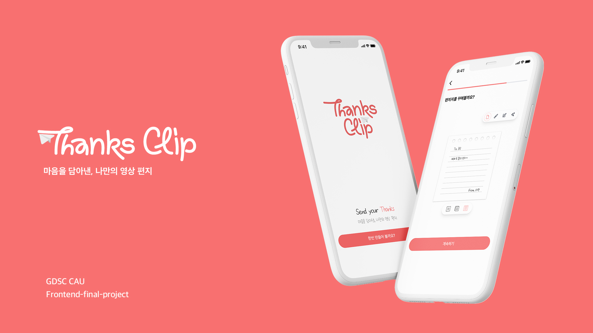

## 🏠 프로젝트 소개

---

**쉽고 빠르게 짧은 동영상을 만들어 고마운 마음을 전해볼까요?**

돌아보면 주변에 참 고마운 분들이 많은 것 같습니다.

이번 기회에 주위의 감사한 사람들에게 하나뿐인 클립 영상으로 마음을 전달해보는 건 어떨까요?

짧은 감사편지를 작성하고, 받는 분에게 어울리는 키워드를 뽑아보세요.

여러분의 감사한 마음을 소중히 담아 영상으로 보내드립니다.


> GDSC CAU Frontend-final-project
> 
> 프로젝트 기간 : 2022.12.30 ~ 2023.01.21


## 🔥 화면 플로우 및 서비스 핵심 기능

---

### 0. 메인 화면
<center>
    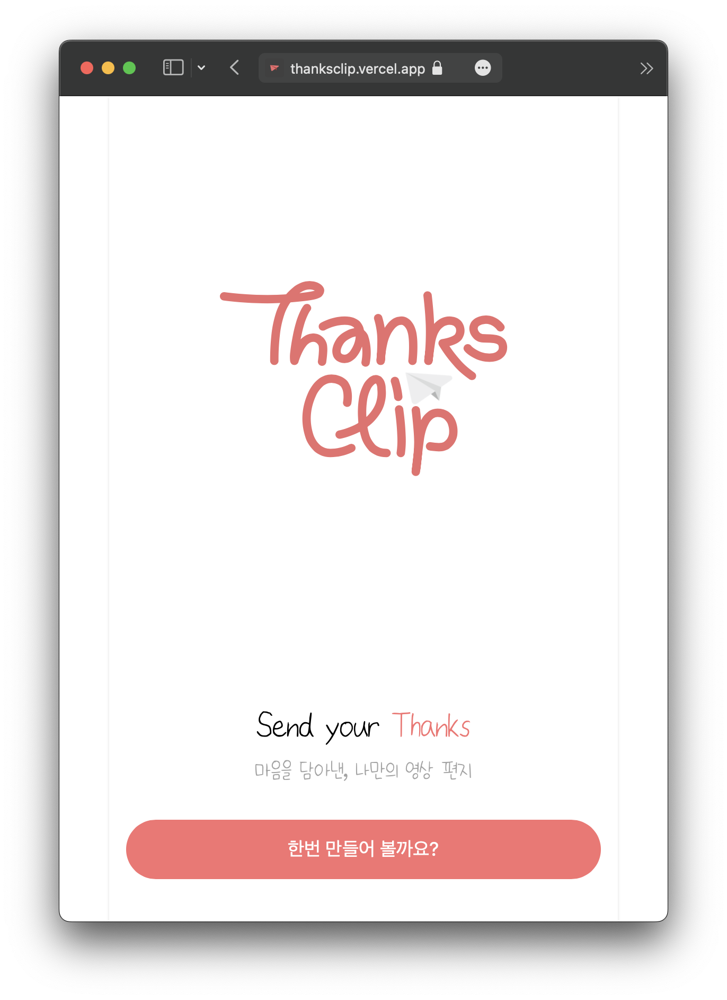
</center>

### 1. 편지 쓰기 - from / to / letter

받는 사람, 보내는 사람의 이름을 입력한 후 편지 내용을 작성합니다.

<center>
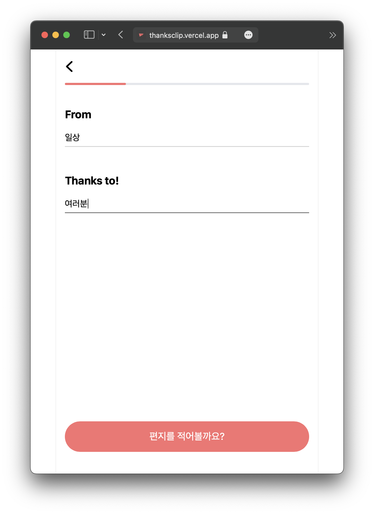
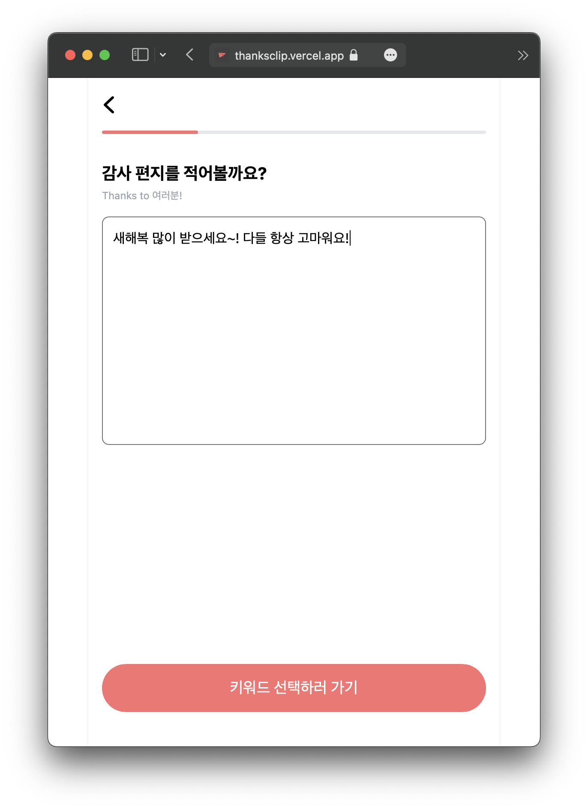
</center>

### 2. 편지 태그 선택

받는 사람에게 어울리는 태그를 2~5개 선택합니다.

<center>
    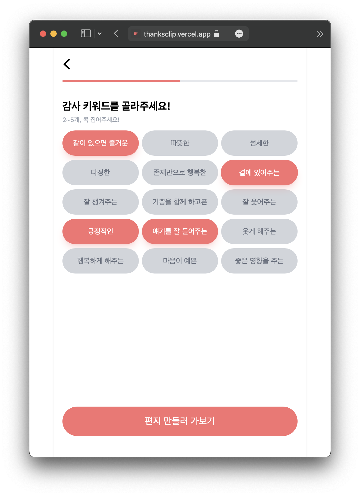
</center>

### 3. 편지지 꾸미기

1. 편지지 선택
<center>
    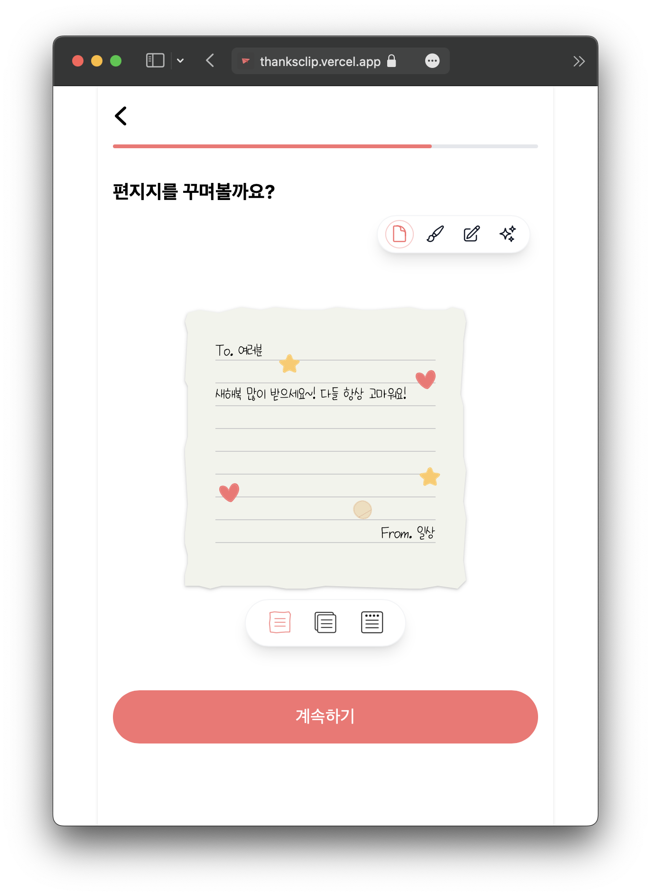
</center>

2. 편지지 색 선택
<center>
    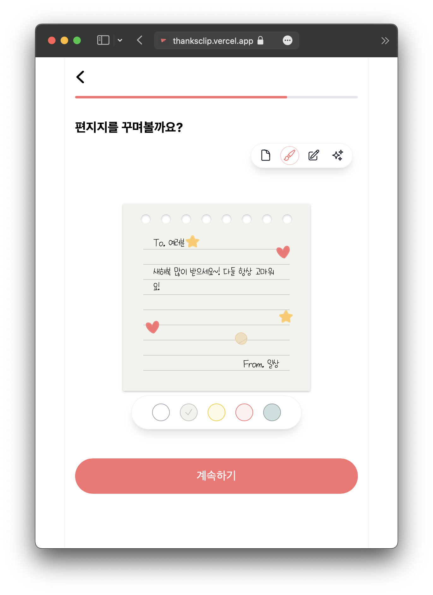
</center>
    
3. 폰트 선택
    3가지 폰트 중 하나를 선택하여 편지 텍스트폰트를 변경할 수 있습니다.
<center>
    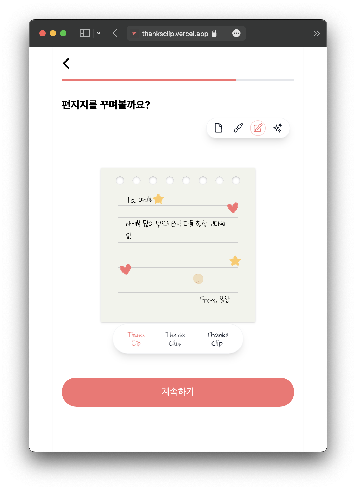
</center>

4. 스티커 추가
<center>
    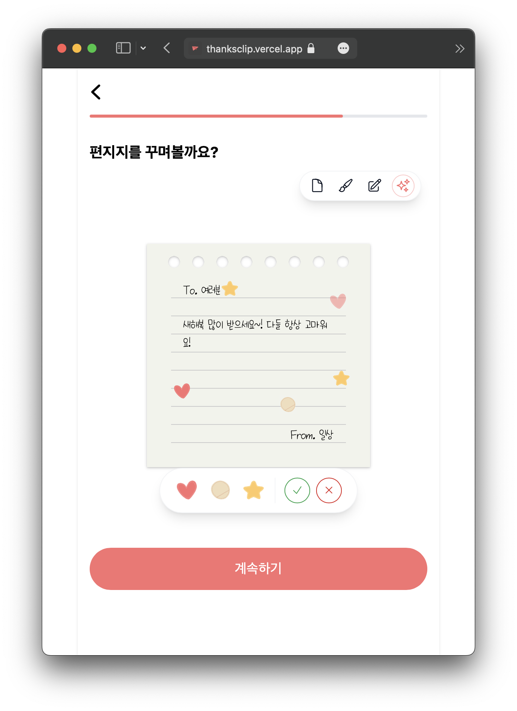
</center>

5. 최종 확인
<center>
    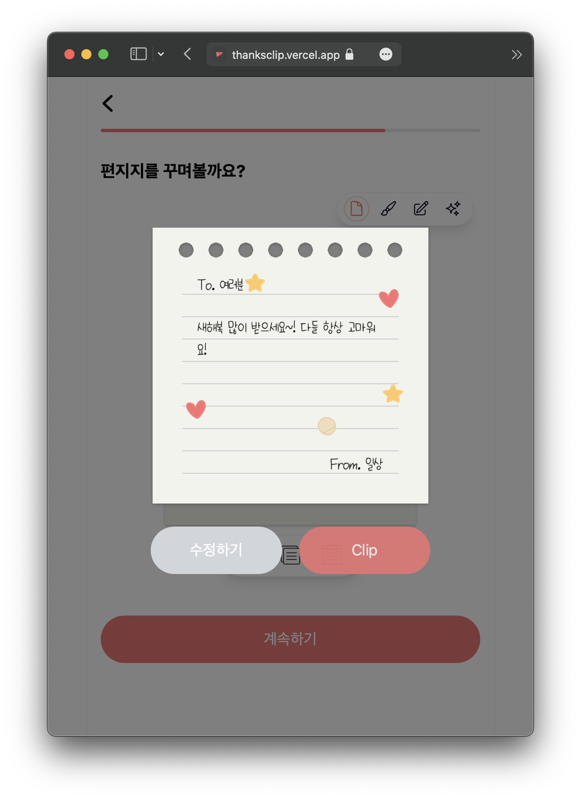
</center>

### 4. 영상으로 내보내기

1. 영상 `server`
    
    `aws lambda` 에서 clip을 만들고, `s3` 로 업로드합니다.
    
    
2. 영상 `client`
    
    서버에서 영상을 만드는 동안 로딩화면이 표시됩니다.
    
<center>
    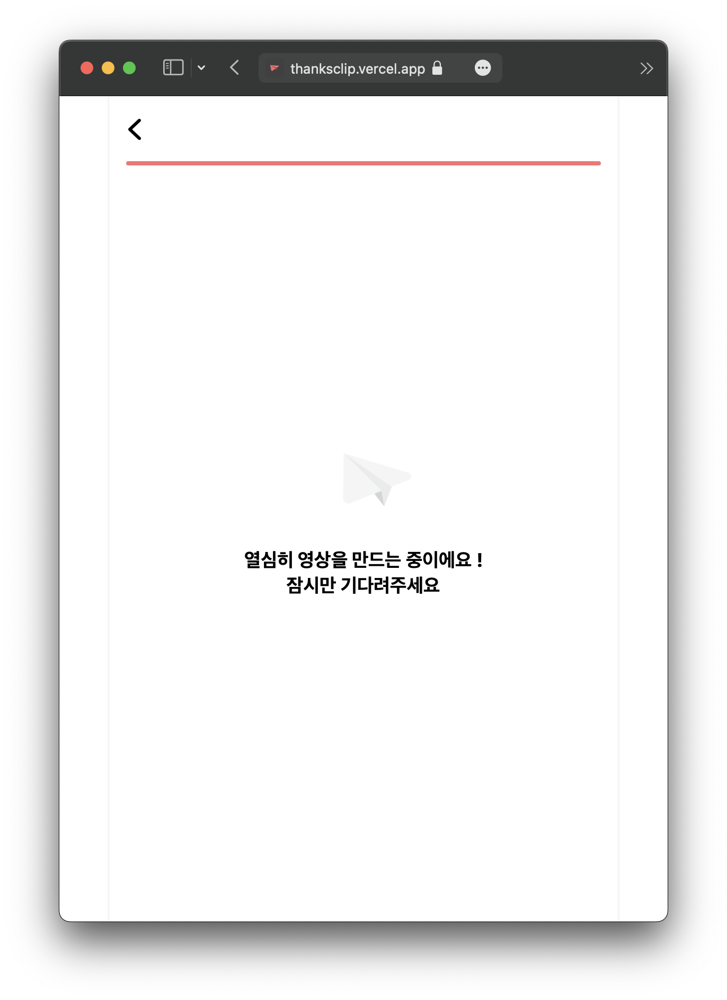
</center>

    만들어진 편지 clip을 공유하기 전에 확인할 수 있습니다.
    
<center>
    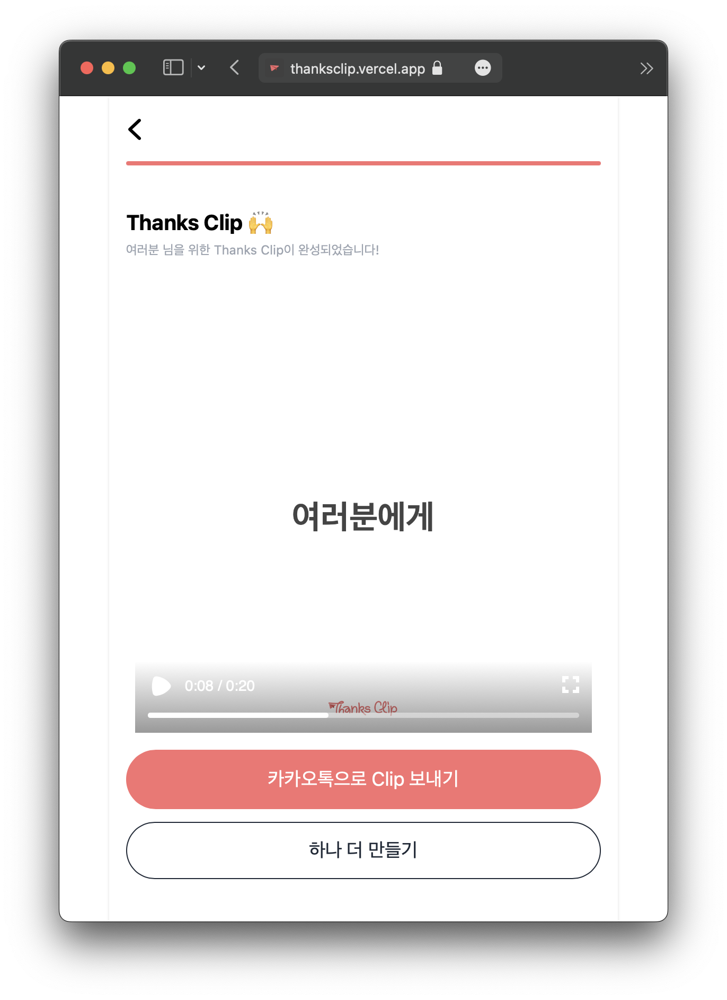
</center>

### 5. 카카오톡 공유

* 보내는 사람
    
    만들어진 영상을 카카오톡 공유 기능을 통해 받는 사람에게 보낼 수 있습니다.
    
* 받는 사람
    
    보내는 사람으로부터 카카오톡 공유링크를 받습니다. 
    
    링크 클릭하면 동적라우팅되어 다운로드페이지로 이동합니다.
    

### 6. 다운로드 페이지

<center>
    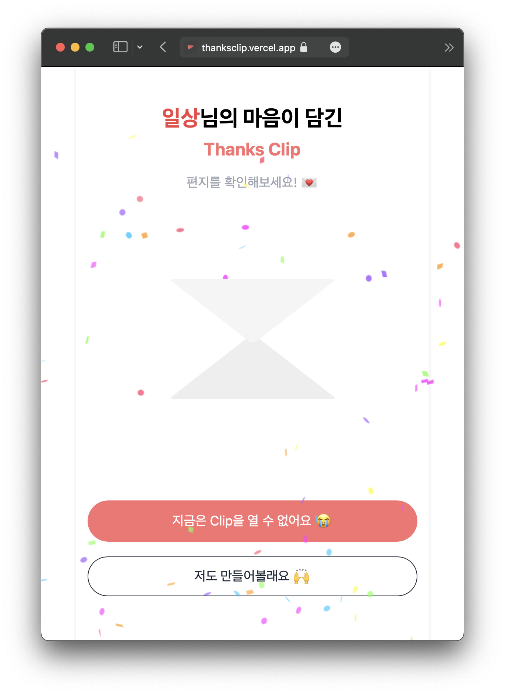
</center>

1. 다운로드
    
    렌더링이 완료되면 다운로드 버튼을 눌러 영상을 다운로드할 수 있습니다.
    
2. 편지 만들기
    
    버튼을 누르면 받는 사람도 편지를 만들 수 있습니다.
    

## 🔨 기술 스택

---

| 역할 | 종류 |
| --- | --- |
| Framework(SSR) | Next.js |
| Core library | remotion cookies-next @vercel/og partytown |
| Styling library | tailwindcss heroicons |
| State Management library | jotai |
| Backend(serverless) | aws lambda + s3 |
| Package Manager | pnpm |
| Formatting | Eslint, Prettier, husky, lint-staged |


## 🚀 우리의 규칙

---

- `**git` branch**
    - 협업시 효율적인 개발을 위해 feautre branch 주도 개발
        - git flow 방법론으로 변경?
    - feature 브랜치 생성 시 브랜치 이름은 `feature/담당자이름/기능이름`
    - feature 브랜치에서 짠 코드를 공유하기 위해 Pull Request를 생성
    - Open된 PR은 팀원들에게 리뷰를 받고, 완료되었다면 main 브랜치로 merge 진행
    - master 브랜치로 push시 `vercel` `CI/CD` 로 자동 배포
- **commit rule**
    
    
    | 제목 | 설명 |
    | --- | --- |
    | env | 개발 환경 셋업 |
    | feat | 새로운 기능 추가 |
    | fix | 버그 수정 |
    | docs | md 문서 수정 |
    | style | 코드 포맷팅, 세미콜론 누락, 코드 변경이 없는 경우 |
    | refactor | 코드 리펙토링 |
    | chore | 빌드 업무 수정, 패키지(package.json...) 수정 |
    | test | 테스트 코드, 리펙토링 테스트 코드 추가 |
- `Folder Structure`
    
    ```
    📦app
     ┣ 📂common
     ┣ 📂download
     ┃ ┣ 📂components
     ┣ 📂service
     ┣ 📂step
     ┃ ┣ 📂1
     ┃ ┣ 📂2
     ┃ ┣ 📂3
     ┃ ┣ 📂4
     ┣ 📜head.js
     ┣ 📜index.css
     ┣ 📜layout.js
     ┣ 📜logo.module.css
     ┗ 📜page.js
    📦atoms
     ┣ 📜index.js
     ┣ 📜letter.js
     ┗ 📜sticker.js
    📦constant
     ┣ 📜cookie.js
     ┣ 📜deployConfig.js
     ┣ 📜letter.js
     ┣ 📜path.js
     ┗ 📜videoConfig.js
    📦pages
     ┗ 📂api
     ┃ ┣ 📜image.jsx
     ┃ ┗ 📜rendering.js
    📦video
     ┣ 📂components
     ┣ 📜CompositionClient.jsx
     ┣ 📜CompositionServer.jsx
     ┣ 📜Root.jsx
     ┣ 📜index.jsx
     ┗ 📜webpack-override.js
    ```
    

## 🎥 결과 영상

---
다음과 같은 결과 영상이 받는 사람에게 전달됩니다!

<center>
    
</center>
